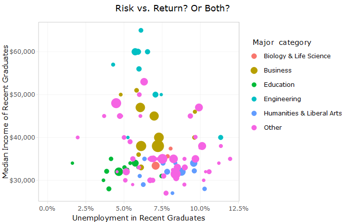

# College Majors & Salary

This repository contains a data analysis of the [College Major & Income dataset](https://github.com/rfordatascience/tidytuesday/tree/master/data/2018-10-16) which comes from the collection of [Tidy Tuesday datasets](https://github.com/rfordatascience/tidytuesday).

The analysis builds upon [David Robinson's live data analysis in R screencast](http://varianceexplained.org/r/tidy-tuesday-college-major/). One of the primary findings of the analysis is the dependence between unemployment and median income of recent graduates.

## Dependencies:
- R and R packages:
  - tidyverse
  - scales
  - ggrepel
  - broom
  - plotly
